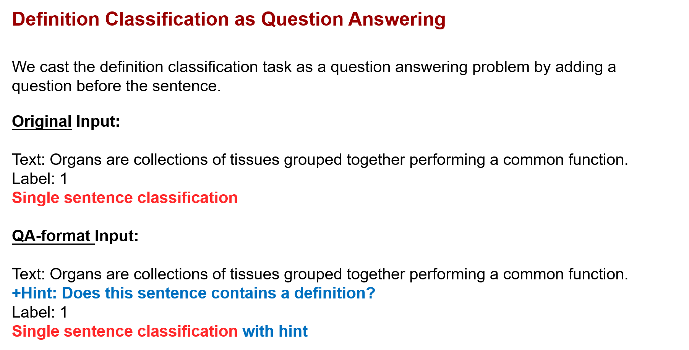
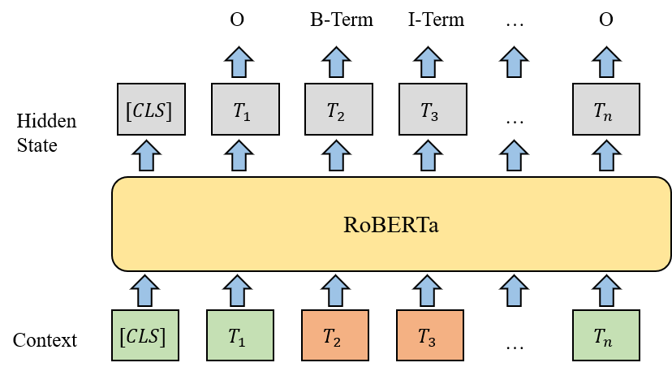

# Deft Def Extraction
Assignment for PKU Advanced Topics in Natural Language Processing 2021 spring.

Deft Corpus Definition Extraction, SemEval2020 Task 6. 

## Prepare environment
```
conda create -n deft python=3.6
conda activate deft
conda install pytorch -c https://mirrors.tuna.tsinghua.edu.cn/anaconda/cloud/pytorch
pip install -r requirements.txt -i https://pypi.tuna.tsinghua.edu.cn/simple
```

## Subtask 1

Task of Sentence Classification: classify the sentences into 1 (contain a definition) or 0 (does not contain a definition).

For the RoBERTa-large baseline, please run the script of `scripts/run_task1.sh`.



### Results

#### Results on dev
|                       | eval_accuracy | eval_f1 | eval_loss | eval_precision | eval_recall |
| --------------------- | ---- | ---- | ---- | ---- | ---- |
| RoBERTa-base | 0.8899 | 0.8367 | 0.2898 | 0.8092 | 0.8662 |
| RoBERTa-base-rsh | 0.8876 | 0.8262 | 0.2906 | 0.8321 | 0.8204 |
| qa-prefix-RoBERTa-base | 0.8830 | 0.8247 | 0.2987 | 0.8054 | 0.8451 |
| qa-prefix-w/o definition-RoBERTa-base | 0.8876 | 0.8304 | 0.2864 | 0.8163 | 0.8451 |
| qa-prefix-bullshit-RoBERTa-base | 0.8865 | 0.8272 | 0.2905 | 0.8201 | 0.8345 |
| qa-suffix-RoBERTa-base | 0.8819 | 0.8209 | 0.3024 | 0.811 | 0.831 |
| qa-suffix-w/o definition-RoBERTa-base | 0.8842 | 0.8243 | 0.2985 | 0.8144 | 0.8345 |
| qa-suffix-bullshit-RoBERTa-base | 0.8807 | 0.8219 | 0.2849 | 0.8 | 0.8451 |
| RoBERTa-large-rsh | 0.8888 | 0.8342 | 0.3001 | 0.8106 | 0.8592 |
| qa-suffix-RoBERTa-large | 0.8956 | 0.8401 | 0.2677 | 0.8386 | 0.8415 |


#### Results on test
|                       | eval_accuracy | eval_f1 | eval_loss | eval_precision | eval_recall |
| --------------------- | ---- | ---- | ---- | ---- | ---- |
| RoBERTa-base |  |  |  |  |  |
| RoBERTa-base-rsh | 0.8545 | 0.7748 | 0.3556 | 0.779 | 0.7706 |
| qa-prefix-RoBERTa-base | 0.8498 | 0.7749 | 0.3482 | 0.7551 | 0.7957 |
| qa-prefix-w/o definition-RoBERTa-base | 0.8591 | 0.7804 | 0.354 | 0.7904 | 0.7706 |
| qa-prefix-bullshit-RoBERTa-base | 0.8626 | 0.7839 | 0.3458 | 0.8015 | 0.767 |
| qa-suffix-RoBERTa-base | 0.8685 | 0.7957 | 0.338 | 0.8029 | 0.7885 |
| qa-suffix-w/o definition-RoBERTa-base | 0.865 | 0.7868 | 0.3637 | 0.8075 | 0.767 |
| qa-suffix-bullshit-RoBERTa-base | 0.8626 | 0.787 | 0.367 | 0.7927 | 0.7814 |
| RoBERTa-large-rsh | 0.8661 | 0.8007 | 0.3613 | 0.7752 | 0.828 |
| qa-suffix-RoBERTa-large | 0.8719 | 0.8022 | 0.3472 | 0.8051 | 0.7993 |


## Subtask 2
Task of Sequence Labeling: tag words with label from [Term, Definition, Alias-Term, Referential-Definition, Referential-Term, Referential-Term, Qualifier, O].

For the RoBERTa-large baseline, please run the script of `scripts/run_task2.sh`.



#### Results on test
```
max_sequence_length=128, epoch=10, lr=3e-5
set training/dev/test/predicted label not in the eval_label_list to 'O'
```
##### RoBERTa-large
|                       | precision | recall | f1-score | support |
| --------------------- | ---- | ---- | ---- | ---- |
| B-Term | 0.7419 | 0.7270 | 0.7344 | 348 |
| I-Term | 0.7056 | 0.6694 | 0.6870 | 487 |
| B-Definition | 0.6557 | 0.6410 | 0.6483 | 312 |
| I-Definition | 0.7642 | 0.7646 | 0.7644 | 4184 |
| B-Alias-Term | 0.7143 | 0.7500 | 0.7317 | 40 |
| I-Alias-Term | 0.3542 | 0.5312 | 0.4250 | 32 |
| B-Referential-Definition | 0.7000 | 0.8750 | 0.7778 | 16 |
| I-Referential-Definition | 0.7000 | 0.9545 | 0.8077 | 44 |
| B-Referential-Term | 0.1818 | 0.4000 | 0.2500 | 5 |
| I-Referential-Term | 0.1250 | 0.1111 | 0.1176 | 9 |
| B-Qualifier | 0.0000 | 0.0000 | 0.0000 | 1 |
| I-Qualifier | 0.0000 | 0.0000 | 0.0000 | 3 |
| O | 0.9279 | 0.9269 | 0.9274 | 16936 |
| accuracy | 0.8825 |
| macro avg | 0.5054 | 0.5654 | 0.5286 | 22417 |
| weighted avg | 0.8834 | 0.8825 | 0.8828 | 22417 |

##### RoBERTa-large + FocalLoss-1
|                       | precision | recall | f1-score | support |
| --------------------- | ---- | ---- | ---- | ---- |
| B-Term | 0.7658 | 0.6954 | 0.7289 | 348 |
| I-Term | 0.7070 | 0.5996 | 0.6489 | 487 |
| B-Definition | 0.6971 | 0.6122 | 0.6519 | 312 |
| I-Definition | 0.7736 | 0.6943 | 0.7318 | 4184 |
| B-Alias-Term | 0.7073 | 0.7250 | 0.7160 | 40 |
| I-Alias-Term | 0.3600 | 0.5625 | 0.4390 | 32 |
| B-Referential-Definition | 0.7500 | 0.7500 | 0.7500 | 16 |
| I-Referential-Definition | 0.7083 | 0.7727 | 0.7391 | 44 |
| B-Referential-Term | 0.2000 | 0.4000 | 0.2667 | 5 |
| I-Referential-Term | 0.1250 | 0.1111 | 0.1176 | 9 |
| B-Qualifier | 0.0000 | 0.0000 | 0.0000 | 1 |
| I-Qualifier | 0.0000 | 0.0000 | 0.0000 | 3 |
| O | 0.9076 | 0.9370 | 0.9221 | 16936 |
| accuracy | 0.8741 |
| macro avg | 0.5155 | 0.5277 | 0.5163 | 22417 |
| weighted avg | 0.8709 | 0.8741 | 0.8717 | 22417 |

##### RoBERTa-large + FocalLoss-2
|                       | precision | recall | f1-score | support |
| --------------------- | ---- | ---- | ---- | ---- |
| B-Term | 0.7422 | 0.7529 | 0.7475 | 348 |
| I-Term | 0.7489 | 0.6982 | 0.7226 | 487 |
| B-Definition | 0.6643 | 0.6090 | 0.6355 | 312 |
| I-Definition | 0.7694 | 0.6931 | 0.7293 | 4184 |
| B-Alias-Term | 0.6809 | 0.8000 | 0.7356 | 40 |
| I-Alias-Term | 0.3226 | 0.3125 | 0.3175 | 32 |
| B-Referential-Definition | 0.6667 | 0.6250 | 0.6452 | 16 |
| I-Referential-Definition | 0.7111 | 0.7273 | 0.7191 | 44 |
| B-Referential-Term | 0.1429 | 0.4000 | 0.2105 | 5 |
| I-Referential-Term | 0.0667 | 0.1111 | 0.0833 | 9 |
| B-Qualifier | 0.0000 | 0.0000 | 0.0000 | 1 |
| I-Qualifier | 0.0000 | 0.0000 | 0.0000 | 3 |
| O | 0.9107 | 0.9348 | 0.9226 | 16936 |
| accuracy | 0.8748 |
| macro avg | 0.4943 | 0.5126 | 0.4976 | 22417 |
| weighted avg | 0.8723 | 0.8748 | 0.8730 | 22417 |
##### RoBERTa-large + FocalLoss-3
|                       | precision | recall | f1-score | support |
| --------------------- | ---- | ---- | ---- | ---- |
| B-Term | 0.7993 | 0.6753 | 0.7321 | 348 |
| I-Term | 0.7488 | 0.6550 | 0.6988 | 487 |
| B-Definition | 0.6832 | 0.5737 | 0.6237 | 312 |
| I-Definition | 0.7779 | 0.7058 | 0.7401 | 4184 |
| B-Alias-Term | 0.6098 | 0.6250 | 0.6173 | 40 |
| I-Alias-Term | 0.3611 | 0.4062 | 0.3824 | 32 |
| B-Referential-Definition | 0.4545 | 0.6250 | 0.5263 | 16 |
| I-Referential-Definition | 0.6415 | 0.7727 | 0.7010 | 44 |
| B-Referential-Term | 0.2000 | 0.4000 | 0.2667 | 5 |
| I-Referential-Term | 0.0769 | 0.1111 | 0.0909 | 9 |
| B-Qualifier | 0.0000 | 0.0000 | 0.0000 | 1 |
| I-Qualifier | 0.0370 | 0.3333 | 0.0667 | 3 |
| O | 0.9121 | 0.9389 | 0.9253 | 16936 |
| accuracy | 0.8776 |
| macro avg | 0.4848 | 0.5248 | 0.4901 | 22417 |
| weighted avg | 0.8757 | 0.8776 | 0.8759 | 22417 |

##  Subtask3 
Task of Relation Classification: predict the relation between the `term` and the corresponding `Definition`.  

For the RoBERTa-base baseline, please run the script of `scripts/run_task3.sh`.


#### Results on test

| Method |  F1-score | 
| ------ | --------- |
| RoBERTa-base-bsz16-epoch5-maxlen256| 0.924 |
|RoBERTa-large-bsz4-epoch5-maxlen256|  0.8984     |

## Acknowledgement
- [DeftEval 2020 (SemEval 2020 - Task 6)](https://competitions.codalab.org/competitions/22759)
- [adobe-research/deft_corpus](https://github.com/adobe-research/deft_corpus)
- [Elzawawy/DeftEval](https://github.com/Elzawawy/DeftEval)